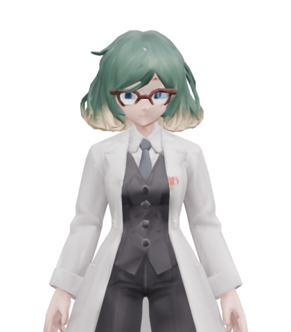

# Howkey — 操作できる科学使い

2026-09-28。添付2枚から制作した、8人目の操作キャラクター。Candidate 1 / delivery revision 11。
開始時とゲーム中の「キャラクターを変える」で **Howkey 科学使い** を選べる。
Fで科学パルス、WASDで移動、Shiftで走行。採集・食事・クラフト・手渡し・手振り・
ジャンプ・騎乗・被弾と復帰にも対応する。Vで524に手を差し出し、リモねこにはしゃがんで撫でる。



## 外見と採用素材

灰緑のボブ、クリーム色の毛先、青灰色の目、赤茶の丸眼鏡、白衣、灰色のベストとネクタイ、
赤い胸章を保持。成人のアニメ調で、人物の大きさは1.55m。資料にない脚部と背面は推定した。
眼鏡の細さや髪の細部は3D復元の表現であり、添付イラストの完全な複製ではない。
`source/brief.md` に依頼、判断、原画像と生成参照の系統を記録している。

| 配信素材 | 内容 | SHA-256 |
| --- | --- | --- |
| `public/models/howkey-scientist/model-r11.glb` | 29,530,492 bytes、66,406三角形、28骨、10クリップ | `f6366ce469d719b2456de06d776bf029e2fdc0a80e9f0ed7c4a51c6bb0ad8c83` |
| `public/models/howkey-scientist/lod-performance-r02.glb` | 912,884 bytes、9,960三角形、28骨 | `7e0fe5d847dcb1956ee575941e7396a63f663a40d43db08fe2e5a06996d0e2d2` |
| `public/models/howkey-scientist/portrait.png` | 配信GLBから描画した420×480の人物画像 | `62f60254e41ef1cab392847f976d91d91df00850bfb178db0d3130f85d17020c` |

LODは28mを基準にヒステリシス付きで切り替え、近距離版と材質・アニメーション中の骨格を共有。
遠距離用の軽い影にも利用する。旧LODファイルと全試作は保持した。

## 制作とリグ

Codexのbuilt-in imagegen → TRELLIS-2 v0.8.1 → 元形状を保った軽量化 → 四肢・白衣・髪のスキン
→ 実測歩走のリターゲット → 配信GLBの検証、の順で制作した。Claude、Tripo、既存人物の外見差し替えは使っていない。
最初の復元は目の欠落と眼鏡の濁りで不採用。正面の頭と両目を明確にした参照v2で同じCandidate 1を修正した。

- 参照v2: `source/reference-v2.png`、SHA `5907781a465bcb50cde4ecdc650d5028f71b8d69c0b79c121ce9e37b3aeffaad`。
- 選択したdense: `work/trellis/dense-attempt-02-res1024-seed0042.glb`、290,190三角形。
  shape 1024、PBR 1024、atlas 4096、24 steps、seed 42。RTX A1000で約506秒。
  SHA `5a701d3ce1f5b040ab8715decb778d1ab9df141d1648b19309cea8625188b24f`。
- 形状補修は特徴を残す微小な平滑化とQEM。採用率0.23、元UVとalbedoを保持。
  denseからの表面距離p95 0.746mm、頭p95 0.987mm、頭の最大サンプル距離3.083mm。
  表面の境界・非多様体エッジは残っており、印刷用の閉じた形状とは扱わない。
- rig05: 標準22骨と白衣4・髪2骨。1頂点最大4ウェイト。顔・眼鏡はHeadへ固定。
  肘、手首、袖口、膝、足首を実形状に合わせ、近接する白衣の内外面のウェイトを空間的になじませた。
  白衣・髪は骨による変形で、布や髪の物理シミュレーションではない。
- motion10: CMUの歩行35_01と走行09_01を120Hzで移した。歩行周期1.116667秒、走行0.733333秒。
  基準速度1.04409／2.98881m/s、ゲーム速度1.4／4.4m/sに再生速度を合わせる。
  足裏支持、膝と肘の曲げ面、骨長、ループ連続性を保持。出典は[既存の人間モーション記録](../human-locomotion/README.md)。
- final11: 1.8秒のDownedを追加。全10動作はIdle_Loop、Walk_Loop、Run_Loop、Gather、Craft、
  Give、Eat、Wave、Attack、Downed。ジャンプ、騎乗、撫では既存のゲーム内姿勢を適用する。

The data used in this project was obtained from mocap.cs.cmu.edu. The database was created with funding from NSF EIA-0196217.

原画像、参照v1/v2、dense 2回、rig01〜05、motion02/04/06/08/10、final03/05/07/09/11、
失敗した検査、各Blenderファイルと作成スクリプトを保持。`revision-history.json` は採否とGLBのSHA一覧。
final05の初期静止画はインポートFPSが不適切だったため、合格根拠には使っていない。
最終Blenderは配信GLBを60fpsで再読込して画像を内蔵したもの。作成時のリグも別に保存した。

## 科学パルスと既存操作

`shared/characters.mts` の新種族howkeyから、サーバーがscienceプロフィールを決定する。
0.4秒の予備動作後に発射、動作0.9秒、再使用1.6秒、消費3、攻撃力24、速度9m/s、最大7m。
空いている左腕を前へ伸ばし、その手のひらへ粒子を集めて発射する。右腕は体の横に置く。
青緑の3つの軌道を持つ粒子表現を、構えと発射の両方で左手のGripへ合わせる。
命中判定・壁遮蔽・射程・消費・再使用はサーバーで確認する。プレイヤー同士は攻撃対象にしない。
発射済みの弾は人物変更後も発射時のプロフィールを保持し、旧魔法弾の挙動も維持する。

人物画像は初期選択、変更メニュー、HUDで共用。デスクトップは8枚、小画面は既存の折り返しと
スクロールで全員に到達できる。オフライン配布も人物一覧から画像を収集する。

リモねこを撫でる際はHowkeyの腕長に合わせて猫が0.54mまで近づく。
足を固定して腰を下げ、白衣の前は膝へ沿わせ、後ろは腰から垂らす。
中断・復帰時には変更した骨の位置と回転を元へ戻す。既存の人物も撫で検査に通過した。

## 最終検証

- 配信GLBそのものの7方向normal＋7方向clay、正しいFPSで再読込した50動作コマを目視。
- 112,427描画頂点を10クリップ・120Hz・計2,056姿勢で検査。最小床Yは−0.195mm。
  重みの正規化、ループ端、ルート固定、有意な三角形の崩壊0を確認。CMU歩走は別に240Hzでも確認。
- ゲームのしゃがみを3方向・10撫で位相、計30姿勢の全頂点で検査。
  最小床Yは+0.000499mm、手の最大目標差0.232mm。適用後の骨位置・回転は完全復帰。
- 自給型ビューアーを実Chromeで23検査。10動作×2方向の通常・半速再生、60スクラブ画像、
  1/4速度、停止、回転、拡大、リセット、小画面。外部通信・ページエラー0。
- 実Chrome2画面＋通信3人で14検査群。選択、歩走・旋回・停止、ジャンプ、手振り、524とリモねこ、
  科学パルス命中と同期、作成・食事・手渡し・採集、人物変更での持ち物保持、橋、騎乗、被弾と復帰、
  縦横画面、再読込を確認。準備座標・資源・敵の一撃は保存なしの検査世界だけ。
- 補足3検査で最終HUD、正面からの実発射、実距離40.11mで9,960三角形／7.82mで66,406三角形への
  往復を確認。ページ・consoleエラー0。
- 全615テスト、型・strict・JS構文・依存境界、全48素材検証を通過。
  走行検査は84描画コマ／1.5926秒で平均52.12fpsを観測。この検査環境の値で、展示性能の保証ではない。

主な記録:

- `validation.json` / `adoption.json` / `revision-history.json`
- `output/model-generation/models/howkey-scientist/qa/final-11/`
- `output/model-generation/models/howkey-scientist/work/final/revision-11/howkey-scientist/qa/numeric.json`
- `output/model-generation/models/howkey-scientist/qa/runtime-crouch.json`
- `output/playwright/howkey/viewer-r11/` / `game-r03/` / `detail-r01/`
- `output/howkey-tests-final.log` / `howkey-check-final.log` / `howkey-assets-final.log`

物理コントローラー、実展示画面、長時間稼働、あらゆる姿勢の自己交差は未検証。
通常サーバーの手動再起動、既存保存の変更、公開デプロイ、コミット・pushは行っていない。
展示ビルドとPC0予備配置の結果、PC1/PC2/PC3の未配布状態は[配布記録](../../docs/howkey-delivery-2026-09-28.md)に記載する。

## 保存先と再確認

モデルライブラリは `../threed-model-creation/models/howkey-scientist/`。
`qa/candidate-1/viewer.html` は正確な採用GLBと表示ライブラリを内蔵し、通信なしで10動作を確認できる。
最終モデルは `work/final/revision-11/howkey-scientist/model-downed-r01.glb`、隣の `source.blend` は編集用。
保存ファイルの全SHAはゲーム側の `archive.json`。記録内の実行パスは生成当時のまま保持する。

`workflow/` はCRO-MAGNONを実行基点とする。新たな生成は依頼があるときに新revisionへ行い、採用版を上書きしない。
現在の配信を再確認する場合:

```powershell
npm test
npm run check
npm run verify:assets
node assets/howkey-scientist/workflow/verify-runtime.mjs
node scripts/qa-howkey-viewer.mjs 11
$env:HOWKEY_QA_OUT = 'output/playwright/howkey/new-game-check'
node scripts/qa-howkey-game.mjs
```

このビューアーのAttackはモデルの手の動作。発光や命中の表現はゲーム側にあり、ゲーム内録画で確認する。

## 2026-10-01 左手からの科学攻撃

ユーザー指定により、両腕の押し出しから、空いている左腕だけを前に伸ばす動作へ変更した。
道具を付けるGrip.R側は下げたまま、0.18秒で構え、0.34秒までに左腕を伸ばす。
0.4秒の発射から0.52秒まで構えを保持し、0.9秒で元へ戻る。発光と発射点はGrip.Lに一致する。

`src/science-cast.ts` が読み込み時にHowkeyのAttackの腕6骨の回転だけを60Hzで組み直す。
元のGLB・LOD・他の動作と胴体・脚・白衣・髪のトラックは保持し、生成後のリグも完全復帰する。
ゲームの既存ミキサーがこのクリップを使うため、他プレイヤー表示・遅れて受信した攻撃・LODも同じ動作になる。
素材内蔵の旧オフラインビューアーは両手の元クリップのまま。新動作はゲーム側で適用する。

関連23テストで配信GLBの構え・発射・復帰、遅延シーク、元データ保持、5方向の左手発光・発射、
人物変更後の科学弾と既存の両手魔法を確認。型/strict・399JS構文・依存境界を確認した。
実Chromeのモデルプレビューで前・横・後ろ、構え・発射・飛翔・復帰、近景/遠景を目視。
プレビューは本番CharacterAssets・CharacterAnimation・SpellEffectsと配信GLBを使用する。
通常3000番の関連3ファイルのSHA一致を確認。新たな実ゲームでの2人同期検証は行っていない。
証拠 `output/howkey-single-hand/`。展示配布・公開デプロイ・サーバー再起動・commit/pushなし。
