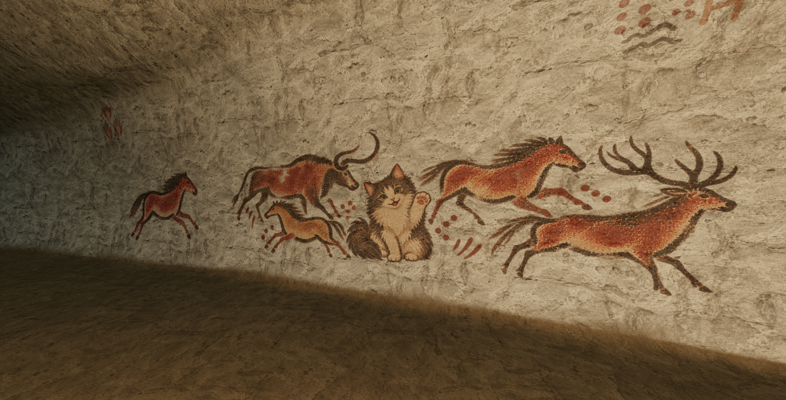

# りもねこの壁画を524の反対側へ復活（2026-10-02）

ユーザーの「高い再現度」「524の反対側」「ラスコー風の動物の中に自然に溶け込む」という指定に対応した。壁画はr30、洞窟形状はr26を維持する。

## 元画像と見た目

本人確認済みの元画像は `assets/rimo-neko/source/user-reference.jpg`。灰白の子猫、丸い目、傾けた頭、見る側の右に上げた前足と肉球、白い胸、左へ丸く回る濃い尾を参照した。以前の壁画アトラスの横たわる猫は別の図柄なので復活に流用していない。

りもねこを中央に、黄土色と赤褐色の野生馬2頭、オーロックス、アカシカを一枚の透過顔料画像として制作した。黒褐色の輪郭、赤・黄土色の塗り、点と短線、かすれを全体で共有する。猫にも同じ顔料の質感を使い、元画像の特徴を読み取れる程度の顔・目・肉球の情報を残す。これはゲーム用の創作構成であり、猫が実際のラスコー壁画に含まれるという説明ではない。

画像は組み込みimagegenで生成し、PNGを無加工で保存・配信した。プログラムで絵を描き直したり、透過背景を後付けしたりしていない。

| 内容             | 記録                                                               |
| ---------------- | ------------------------------------------------------------------ |
| 元画像SHA-256    | `3a0ebdfadbb383d170318a0cd4d3cb9540ccb113822bc0a44836dfcaeeebdf41` |
| 顔料画像         | `assets/camp-cave/source/rimo-lascaux-frieze-r30.png`              |
| 配信画像         | `public/models/camp-cave/rimo-lascaux-frieze-r30.png`              |
| 顔料SHA-256      | `b750045fda524816577747197874d173d41161e2b55d9acfe772a8f37f8d01df` |
| 解像度・容量     | 2172×724 RGBA、2,272,546 bytes                                     |
| 生成条件         | `assets/camp-cave/rimo-lascaux-prompt-r30.txt`                     |
| 依頼・参照の対応 | `assets/camp-cave/rimo-frieze-request-r30.json`                    |

## ラスコーの一次資料と今回の判断

フランス文化省の公式資料を調べ、モチーフ・色・重なり・岩肌への描き方を参照した。下記の「反映」は制作上の判断であり、特定の壁面の厳密な複製ではない。

| 一次資料                                                                                     | 確認した点と反映                                                                                                                           |
| -------------------------------------------------------------------------------------------- | ------------------------------------------------------------------------------------------------------------------------------------------ |
| [Themes](https://archeologie.culture.gouv.fr/lascaux/en/themes-0)                            | 馬、鹿、オーロックスなどの動物と記号。猫の周囲に馬・オーロックス・鹿を選んだ。                                                             |
| [Raw materials](https://archeologie.culture.gouv.fr/lascaux/en/raw-materials)                | 赤・黄・黒を基本とする鉱物顔料、鉄・マンガン。鮮やかな多色塗りを抑え、赤褐色・黄土色・黒褐色でまとめた。黒を一律に木炭由来とは説明しない。 |
| [Techniques](https://archeologie.culture.gouv.fr/lascaux/en/techniques)                      | 描線、塗り、吹き付け等の方法。均一なベタ面を避け、粒と線の濃淡を使った。                                                                   |
| [Construction of panels](https://archeologie.culture.gouv.fr/lascaux/en/construction-panels) | 動物群の順序・重なり・構成。各動物を枠で区切らず、高さと向きを変えて一続きにした。                                                         |
| [Rock support](https://archeologie.culture.gouv.fr/lascaux/en/rock-support)                  | 岩肌・方解石の面と描画方法の関係。既存の孔・層理・凹凸を顔料の下に保持した。                                                               |

## ゲームへの組み込み

- 東壁（入口から入ると左側）の局所Z **-21.2**に中心を置いた。524は向かいの西壁の同じZにある。
- 新しい一続きの絵は幅**7.5m**、高さ**2.5m**、下端**1.6m**。既存の東壁マンモス・バイソン2配置を置き換える。西壁の両動物を含む他13配置はr29と一致する。
- 524の位置・1.34m画像幅・顔料・色を保持。左右両壁を含む全体は14投影配置になった。新しい1配置の中に5体が描かれる。
- `cave-materials.ts` の既存岩肌シェーダーへ透過顔料を追加した。洞窟GLBの実三角形に投影し、岩の色・凹凸・火の照明を受ける。板状メッシュは追加しない。
- 追加テクスチャはsRGBで読み込み、異方性フィルターを適用。洞窟解放時と描画終了時に破棄する。
- 洞窟GLB・UV・歩行面・地形・実際に歩くりもねこのGLBは変更していない。洞窟SHAは `65dde1aa7311b88c159d524d93af82a770dac77e48ee1f35356e3000cad8a15f`。

## 検証と範囲

顔料を実GLBへ照合し、全**2,139点**で欠け・壁の外へのはみ出し0。新しい絵だけで**1,272点**を検査した。各既存配置にも30点を超える顔料標本がある。これは標本検査であり、全画素の証明ではない。

Chromeの実ゲームで全体・近景・524側・両壁・通常カメラを目視確認し、10枚の描画画像を保存。2画面＋通信3人の計5人で、実際のE操作による消火・再点火を共有した。片方のページを再読み込みし、通常の参加画面から入り直して同じ新顔料を読み込むことを確認。両タブのブラウザーエラーログは0件だった。

確認用サーバーは保存を持たない独立のゲーム。初期位置を洞窟に設定し、敵を除去し、最初の火を点灯している。壁画確認用の観察カメラを追加したが、洞窟形状・材質・照明・通信は通常の実装を使用した。通常カメラでも確認した。今回、初期キャンプからの実手入力による徒歩入洞を再実施したとは扱わない。

記録:

- `assets/camp-cave/qa/gallery-r30.json`: 採用記録、配置、SHA、配信照合。
- `assets/camp-cave/qa/gallery-surfaces-r30.json`: 実壁面の標本。
- `assets/camp-cave/qa/gallery-pigment-coverage-r30.json`: 透過顔料との照合。
- `output/cave-rimo-r30/game-review.json`: 画面・通信・操作の記録と検証範囲。
- `output/cave-rimo-r30/captures.json`: 各PNGのSHA、カメラ、火、人数。

関連18テスト、型・strict、434 JS構文、依存境界、変更書式が成功した。旧テストの「両壁に同じ5動物」前提を今回の配置へ更新し、通路幅・天井高さ・洞窟出入り・山道の既存検査を維持した。確認用サーバーの14配信ファイルもSHA一致。

公開用の**ローカルビルド**も成功（448ファイル・472.0MiB）。新しいPNGが配信バンドルに含まれ、原本とSHA一致することを確認した。公開先へのアップロードは行っていない。

制作物と検証画像の保存先はモデルライブラリの `models/rimo-neko/wall-mural/r30/`。既存の3D候補とは別の2D壁画改訂として保持し、`assets/camp-cave/archive-mural-r30.json` に各ファイルのSHAを記録する。

再確認手順:

1. `node scripts/build.mjs`。
2. `node scripts/measure-cave-gallery.mjs` と `assets/camp-cave/workflow/measure-gallery-pigment.py`。
3. `node --test tests/cave-rimo-mural.test.mjs tests/cave-fire.test.mjs tests/camp-landform.test.mjs tests/camp-surface-continuity.test.mjs`。
4. `node scripts/qa-cave-rimo-r30.mjs` で表示されたローカルURLをChromeで開き、二画面参加・E操作・表示と再参加を確認する。観察UIの「表示画像を保存」で実描画を保存する。`game-review.json` の手動観察記録も今回の結果へ更新する。
5. `node scripts/verify-cave-gallery.mjs http://127.0.0.1:<確認用ポート>/` で保存画像・配置・顔料・配信ファイルを照合する。

物理端末・小画面・持続FPS・長時間稼働は今回未検証。通常3000番の起動、ユーザー保存の変更、展示配布、公開デプロイ、commit/pushは行っていない。
